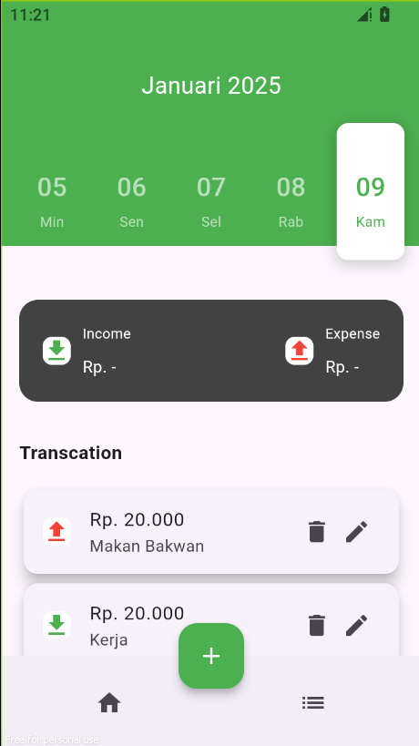

# Monexa

Monexa is a financial tracking and budgeting application built using Flutter. It helps users efficiently manage their personal finances, track expenses, and stay on top of their financial goals.



## Getting Started

This project serves as a starting point for developing the Monexa Flutter application.

### Prerequisites

- Install [Flutter SDK](https://docs.flutter.dev/get-started/install)
- Set up your preferred code editor (e.g., [VS Code](https://code.visualstudio.com/) or [Android Studio](https://developer.android.com/studio))

### Installation

1. Clone the repository:

   ```bash
   git clone https://github.com/your-username/monexa.git
   cd monexa
   ```

2. Install dependencies:

   ```bash
   flutter pub get
   ```

3. Run the application:
   ```bash
   flutter run
   ```
